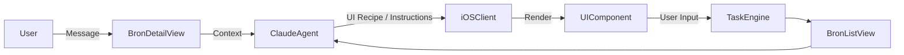

#  **Bron — Deep Agents for Everyone**

> **Bron** is an iOS app that turns AI into a *reliable teammate* instead of just a chatbot.
> Powered by **Claude**, every Bron can plan, execute, and manage tasks in the background — asking you for information only when it’s needed.

### 🧠 **AI Agents** • 🗂️ **Dynamic Tasks** • 🎯 **Structured Execution** • 📱 **Native iOS UI**

### Built for students, creators, and anyone who’s tired of juggling everything manually.

---

## 🚀 What is Bron?

Bron rethinks the relationship between people and AI.
Instead of a single chat thread where everything happens, each **Bron** is:

* A **dedicated agent** with its own task
* A **planner** that breaks your goals into executable steps
* A **worker** that continues progress in the background
* A **communicator** that only interrupts you with structured UI forms when necessary

No “prompt engineering.” No chaos. Just clarity and movement.

---

## ✨ Key Features

### 🗂️ **BronListView — Your Agents at a Glance**

A dashboard showing all Brons currently working in the background:

* Status badges (Working, Waiting, Needs Info, Ready)
* Progress indicators
* Last-active timestamps
* One-tap quick actions (Open / Provide Info / Execute)

---

### 💬 **BronDetailView — Chat With Purpose**

The chat is the workspace.
Bron messages are combined with **UI components generated on the fly**:

* File uploads
* Pickers (dates, contacts, files)
* Forms (receipt details, podcast outline, calendar selection)
* Confirmation gates for safe execution

All rendered natively via a **strict UI Recipe schema**.

---

### 🔧 **Skill System — Train Bron in How You Work**

Turn repeatable workflows into reusable automations:

* “How I submit receipts”
* “How I create a podcast episode”
* “How I prepare a study session”

Skills are editable, versioned, and attachable to new tasks.

---

### 🎛️ **Subtle Personalization**

Bron adapts to:

* Your tone (concise, coaching, formal, casual)
* Your preferred UI density
* Your common task types
* Your interaction patterns

No loud “themes.” Just a quiet sense that Bron understands how you operate.

---

### 🛡️ **Safety First**

* Brons cannot delete files
* Brons cannot send secrets to the server
* All external actions require confirmation
* Device-side redaction for sensitive fields

---

## 🧩 How It Works

### 🧠 Conceptually

Bron determines *exactly* what information it needs to advance a task, and generates a UI component to collect it — instead of relying on hardcoded “task complexity.”

---

## 🧱 Architecture Overview

<strong>📦 Tap to view architecture details</strong>

### **Client (iOS / SwiftUI)**

* Chat engine
* UI Recipe renderer
* Background task manager
* Local personalization profile
* Secure storage

### **Server**

* Task orchestration
* State management
* Claude integration
* UI Recipe generation
* Non-destructive action enforcement

### **Claude (Deep Agent Layer)**

* Goal interpretation
* Task planning
* UI Need identification
* Structured reasoning
* Background progress

---

## 📋 Example Tasks Bron Can Handle

| Task                               | What Bron Does                                                |
| ---------------------------------- | ------------------------------------------------------------- |
| “Submit my receipt”                | Generates a receipt form, drafts email, waits for approval    |
| “Find photos of me”                | Asks for source + date range, uses on-device search           |
| “Create a podcast”                 | Multi-stage plan: concept → outline → equipment → workflow    |
| “Message people who haven’t RSVPd” | Gathers event + template, drafts messages, waits for approval |
| “What’s the weather tomorrow?”     | Answers instantly and optionally makes a daily check task     |

---

## 🛠 Project Roadmap (High-Level PRs)

<strong>Click to expand full PR roadmap</strong>

### **PR-01** — Core Data Models

### **PR-02** — Claude Integration

### **PR-03** — BronDetailView (Chat)

### **PR-04** — UI Recipe Rendering Engine

### **PR-05** — BronListView

### **PR-06** — Background Task Engine

### **PR-07** — Plan Mode

### **PR-08** — Skill System

### **PR-09** — Personalization Engine

### **PR-10** — Notifications & UX Polish

Each PR contains detailed subtasks in the `docs/PRD.md`.

---

## 💡 Why We Built Bron

Technology should not drown people with more complexity.
Bron exists to:

* Reduce cognitive load
* Automate routine tasks
* Transform goals into actionable plans
* Give users back their time

For college students especially, Bron becomes a **personal project manager**, **assistant**, and **thinking teammate**.

---

## 📲 Platform Support

* **iOS 17+** (universal)
* macOS support planned
* No Android plans yet (but contributions welcome!)

---

## 🧑‍🍳 Contributing

We welcome contributions of all kinds:

* UX patterns
* SwiftUI components
* Agent prompt design
* Architecture improvements
* Documentation

Check `CONTRIBUTING.md` for guidelines.

---

## 📄 License

MIT License.
Bron is fully open for developers, students, and researchers.

---

## ⭐ Join Us

If you believe AI should help people *live better*, not just chat with them—
Bron is for you.

**→ Star the repo to follow development!**
